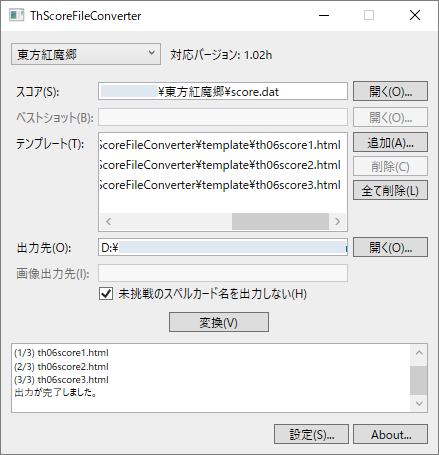
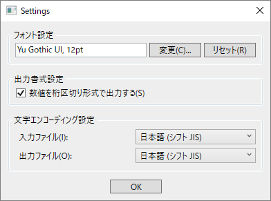

.. _howtouse:

使い方
======

.. _mainwindow:

メイン画面
----------

:file:`ThScoreFileConverter.exe` を起動すると表示されます。

1. 左上のコンボボックスから作品名を選択してください。

2. 選択した作品について初めて実行する場合、 以下の手順を実施してください。
   以前に一度でも実行したことがある場合は、 その時の選択状況が設定ファイル
   (:file:`settings.xml`) から読み込まれるので、 以下の手順を省略できます。

   a. 以下のどちらかの方法で、 スコアファイル (:file:`score.dat` など)
      を選択してください。

      * :guilabel:`スコア(&S)`  欄右側の :guilabel:`開く(&O)` ボタンを押し、
        ファイル選択ダイアログを使って選択する。
      * :guilabel:`スコア(&S)` 欄にスコアファイルを Drag & Drop する。

   b. 以下のどちらかの方法で、 ベストショット (:file:`bs\_01\_1.dat` など)
      またはスクリーンショット (:file:`sc\_01\_01.dat` など)
      が保存されているフォルダーを選択してください。 (文花帖形式の場合のみ有効)

      * :guilabel:`ベストショット(&B)` 欄右側の :guilabel:`開く(&O)`
        ボタンを押し、 フォルダー選択ダイアログから選択する。
      * :guilabel:`ベストショット(&B)` 欄にそのフォルダーを Drag & Drop する。

   c. 以下のどちらかの方法で、 :term:`テンプレートファイル` を選択してください。
      (複数選択可)

      * :guilabel:`テンプレート(&T)` 欄右側の :guilabel:`追加(&A)`
        :guilabel:`削除(&C)` :guilabel:`全て削除(&L)` ボタンを使って選択する。
      * :guilabel:`テンプレート(&T)` 欄にテンプレートファイルを Drag & Drop
        する。 (複数可)

   d. 以下のどちらかの方法で、
      変換後のファイルの出力先フォルダーを選択してください。

      * :guilabel:`出力先(&O)` 欄右側の :guilabel:`開く(&O)` ボタンを押し、
        フォルダー選択ダイアログから選択する。
      * :guilabel:`出力先(&O)` 欄にそのフォルダーを Drag & Drop する。

   e. ベストショットやスクリーンショットの変換後の画像ファイル
      (:file:`*.png`) の出力先フォルダー名を、 :guilabel:`画像出力先(&I)`
      欄に入力してください。 (文花帖形式の場合のみ有効)

   f. 未挑戦のスペルカード名も出力する場合はチェックを外してください。
      (東方花映塚以外の場合のみ有効)

3. :guilabel:`変換(&V)` ボタンを押してください。

.. _settingwindow:

設定画面
--------

:ref:`mainwindow` の :guilabel:`設定(&S)` ボタンを押すと表示されます。

* 言語設定

  * GUI の表示言語を変更するには、 コンボボックスから選択してください。
    選択した言語が即座に反映されます。
    なお、 この設定は変換結果には影響しません。

* フォント設定

  * GUI のフォントを変更するには、
    :guilabel:`変更(&C)` ボタンを押し、
    フォント選択ダイアログを使って好みのフォントとサイズを選択してください。
    フォント選択ダイアログの各ボタンを押すと、 それぞれ以下の通り動作します。

    * :guilabel:`OK` ボタン
      ... 選択した内容が即座に反映され、 フォント選択ダイアログが閉じます。
    * :guilabel:`キャンセル` ボタン
      ... 選択した内容は破棄され、 フォント選択ダイアログが閉じます。
    * :guilabel:`適用(&A)` ボタン
      ... 選択した内容が即座に反映されます。
      フォント選択ダイアログは表示されたままとなります。

  * GUI のフォントをシステム既定値に戻すには、
    :guilabel:`リセット(&R)` ボタンを押してください。

* 出力書式設定

  * :guilabel:`数値を桁区切り形式で出力する(&S)`
    チェックボックスのチェックの有無により、
    変換後のファイルに含まれる数値の出力が以下の通り変化します。

    * チェックあり ... ``1,234,567`` のように出力されます (ただし西暦年を除く)。
    * チェックなし ... ``1234567`` のように出力されます。

* 文字エンコーディング設定

  * :guilabel:`入力ファイル(&I)` コンボボックスから、
    テンプレートファイルに使われている文字コードを選択してください。
    選択を間違えると文字化けの原因になります。
  * :guilabel:`出力ファイル(&O)` コンボボックスから、
    変換後のファイルに使う文字コードを選択してください。
